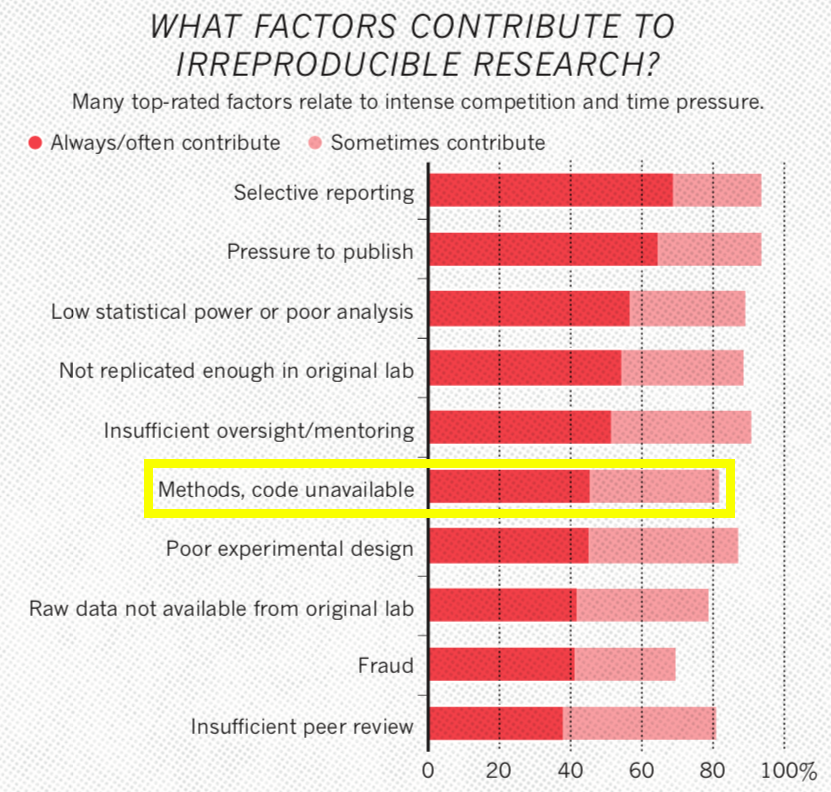
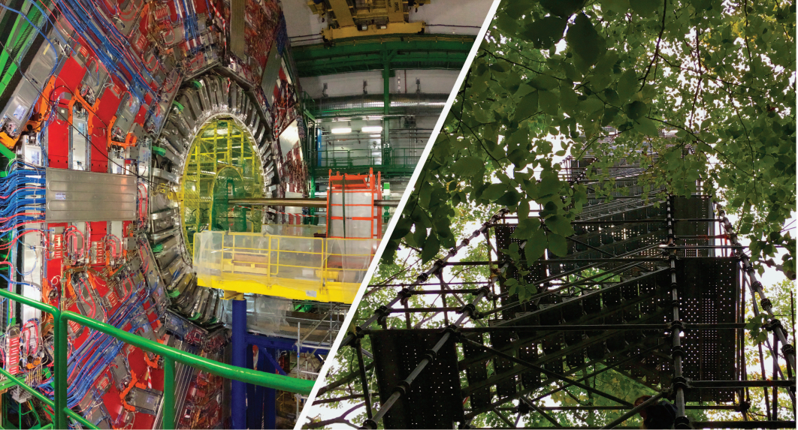
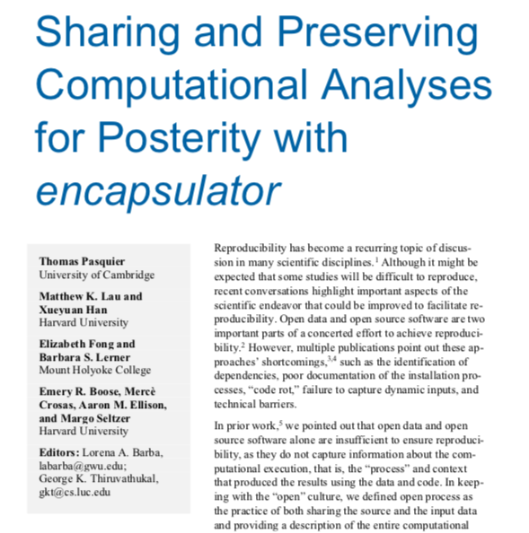
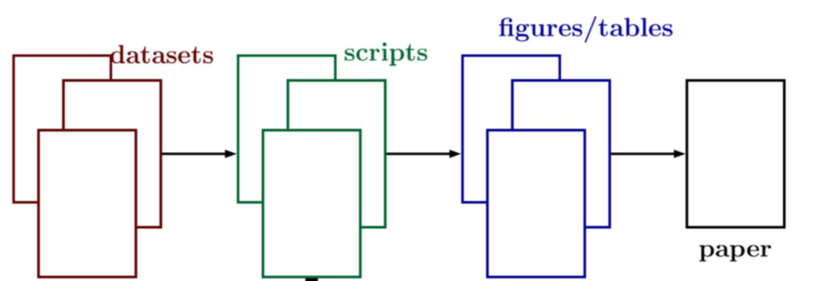
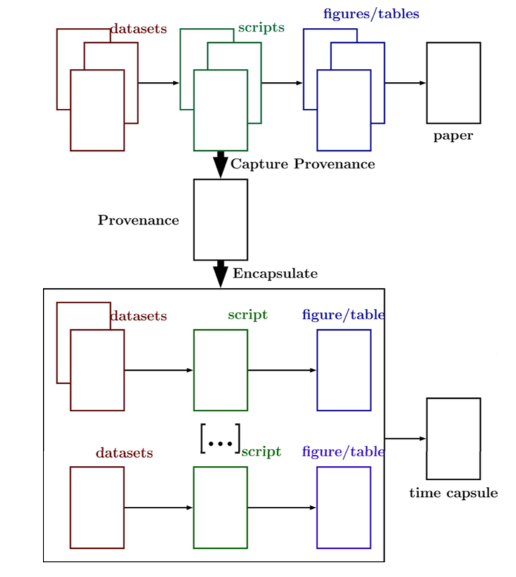
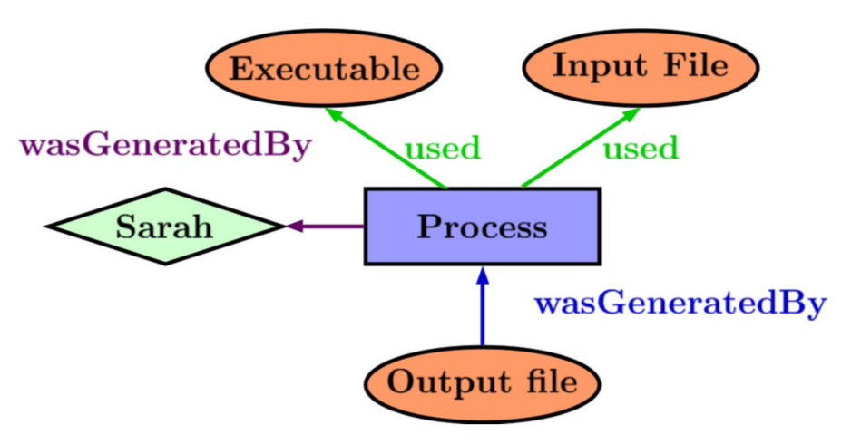
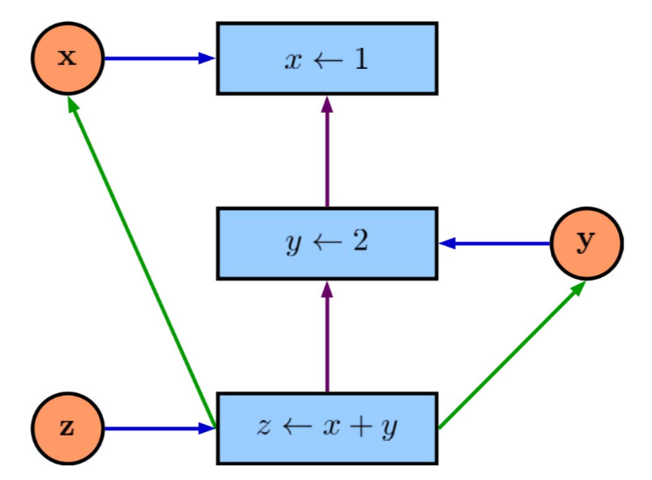
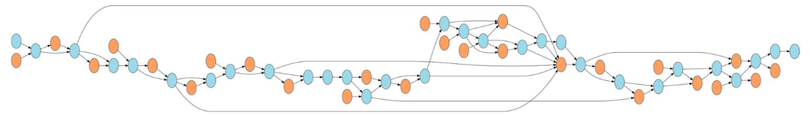
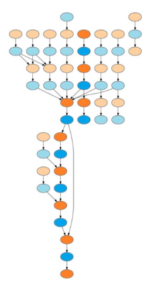

<!-- output: powerpoint_presentation -->

<!-- ```{r setup, include=FALSE} -->
<!-- knitr::opts_chunk$set(echo = FALSE) -->
<!-- ``` -->


# 


<!-- I'm an ecologist -->

# 

<!-- long an open-source proponent  -->

"Software should not limit science."

# 


# 


# 




# 


<!-- However, after almost ten years of being an open-source advocate... -->
<!-- Ecologists aren't CS majors, they're tree climbing, scub-diving types -->

# 


<!-- Single-minded software, get the analysis done! -->

# 


# 



<!-- Similar challenges in Ecosystem Ecology and Particle Physics -->

# 


# 




# Encapsulator

Goal: Simplify computational reproducibility

1. Create a data "capsule" with code, data and environment
2. Increase transparency with "cleaned" code and workspace

# 

{width=70%}

# 

{width=100%}

# What is data provenance?

{width=100%}

# What is data provenance?

{width=100%}


# Prov. Huh. What is it good for?

{width=100%}

# 

{width=50%} 

# 

{width=50%}

# Challenges

- Out-of-tree Libraries 
- Nondeterminism
- Capsule OS (*Linux*, *VirtualBox*) 
- Language Support (*R*)

# Future Directions

- Test Dataverse products
- Integration with IDEs (*RStudio*)
- Container Support (e.g. *Docker*)
- Domain-Specific Environments

**Email: _matthewklau@fas.harvard.edu_**
**Github: MKLau**

*This work was supported by NSF grants SSI-1450277 (End-to-End Provenance) and ACI-1448123 (Citation++).*

*More details about those projects are available at
 https://projects.iq.harvard.edu/provenance-at-harvard.*
