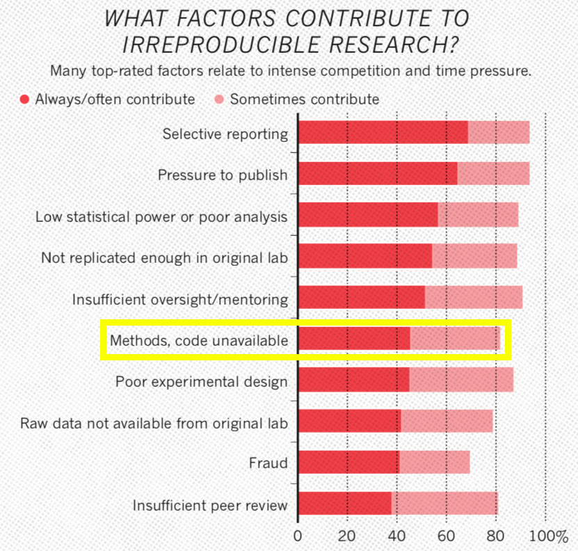

<!-- output: powerpoint_presentation -->
<!-- ```{r setup, include=FALSE} -->
<!-- knitr::opts_chunk$set(echo = FALSE) -->
<!-- ``` -->

# 

# Goal

- Easier methods for bridging the software engineering gap
- Capsules and provenance
- mkSci = continuous integration is the future of science

# Notebooks

- Rmarkdown
- Jupyter Notebooks

# Capsule Databases/Engines

- CodeOcean
- Globus


# 


# 


# 



# 


<!-- I'm an ecologist -->


# Motivation: Code in Ecology

{width=70%}

# Motivation: Ecology Journal Policies

{width=50%}

*Meeslan, Heer and White 2016 Trends in Eco Evo*

# Motivation: Social Science Journal Policies

{width=70%}

*Crosas et al. 2018 SocArXiv*

# Motivation: Journal Policy Impacts

{width=70%}


# Motivation: Journal Policy Impacts

{width=70%}

# Motivation: Journal Policy Impacts

{width=70%}

*Stodden et al. 2018 PNAS*

# Goal: Repeatability/Reproducibility

metadata + data + code + results + contact

# Goal: Repeatability/Reproducibility

BestPractices(metadata + data + code + results + contact)

# Goal: Repeatability/Reproducibility

BestPractices(metadata * data * code * results * contact)

# Opportunity: Benefaction not just reproducibility

$$ Synthesis = f(benefaction) $$

# Opportunity: Benefaction not just reproducibility

{width=70%}

*Colberg et al. 2015 Comm ACM*

# Opportunity: Benefaction not just reproducibility

{width=70%}

*Colberg et al. 2015 Comm ACM*

# Opportunity: Benefaction not just reproducibility

{width=70%}

*Colberg et al. 2015 Comm ACM*


# Tools: Research Pipeline

| Thought      | Data Collection            | Data Processing               | Analysis                          | Reporting                  | 
| :---------   | :------------------------- | :---------------------------- | :-------------------------------- | :------------------------- | 
| *Meta-Data*  | *Meta-Data* + *Provenance* | *Provenance* + *Versioning*   | *Versioning* + *Provenance*       | *Lit Prog* + *Versioning*  | 


<<<<<<< HEAD
=======
# Tools: Overview

|                 | Dataverse  | Code Ocean  |  Zenodo   | Figshare  | Dryad    | PANGAEA | GitHub & Bitbucket | Supplementary Material |
| :-------------- | :----:     | :----:      | :----:    | :-------: | :---:    | :-----: | :----------------: | :--------------------: |
| Meta Data       | Yes        | Yes         |  Yes      | Yes       | Yes      | Yes     | Yes                | Yes                    |
| Data Hosting    | Yes        | Yes         |  Yes      | Yes       | Yes      | Yes     | Yes                | Yes                    |
| Code Hosting    | Yes        | Yes         |  Yes      | No        | No       | No      | Yes                | Yes                    |
| Versioning      | No?        | No?         |  Yes      | No        | No       | No      | Yes                | No                     |
| Capsules        | No         | Yes         |  No       | No        | No       | No      | No                 | No                     |
| Assigns DOI     | Yes        | Yes         |  Yes      | Yes       | Yes      | Yes     | No                 | No                     |
| License         | Flexible   | Flexible    | Flexible  | MIT       | CC0      | CC-BY   | Flexible           | None                   |
| Cost            | None       | Possible    |  None     | None      | Possible | None    | None               | None                   |

*Adapted from Mislan, Heer & White 2016 Trends in Ecol Evol*

>>>>>>> 73d3a56490ddaf223e9b2a0cc1cad60b8683899c

# Reality: Common Ground

{width=70%}

# Reality: Common Ground

{width=70%}

<!-- Similar challenges in Ecosystem Ecology and Particle Physics -->

# Reality: Common Ground

- *Most scientists don't want to produce software, they want to do
science.* 


# Reality: Common Ground

- *Most scientists don't want to produce software, they want to do
science.* 

- *Let's automate as much of the process as we can to lower activation
energy, decrease error rates and increase sharing.*


# Tools: Encapsulator 


# Tools: Encapsulator 

Goal: Simplify computational reproducibility

1. Create a data "capsule" with code, data and environment

# Tools: Encapsulator 

Goal: Simplify computational reproducibility

1. Create a data "capsule" with code, data and environment
2. Increase transparency with "cleaned" code and workspace


# What is data provenance?

{width=80%}


# encapsulator(A Kit of Parts): Capsule creation

- Virtual Machine (encapsulator)
- Docker (containR)
- Literate computing notebook (Jupyter)
- Compressed (Reprozip)
- Capsule database (Code Ocean)


# Conclusion: The next great challenge is synthesis

<!-- Benefaction not irreproducibility! -->

** Software should not limit science **

# Conclusion: The next great challenge is synthesis

{width=20%}


# Questions and Discussion:

*Possible discussion topics:*

{width=20%}

1. What checks are in place to verify and link dataverses?
2. Can provenance production become a part of the checking system?
3. What are the pros and cons of automated checking/verification
   and/or cleaning/encapsulation of dataverses?
4. I'm focused on R's wild-wild-west, but how does this translate to
   other languages?

*Contact Info:*

**Email: _matthewklau@fas.harvard.edu_**

**Github: MKLau**

**Slack: MKLau**

*Much of this work was supported by NSF SSI-1450277 (End-to-End Provenance) and ACI-1448123 (Citation++).*
*More details are available at https://projects.iq.harvard.edu/provenance-at-harvard*

{width=19%}
{width=20%}
{width=25%}
{width=15%}
<<<<<<< HEAD


# Tools: Overview

|                 | Dataverse  | Code Ocean  |  Zenodo   | Figshare  | Dryad    | PANGAEA | GitHub & Bitbucket | Supplementary Material |
| :-------------- | :----:     | :----:      | :----:    | :-------: | :---:    | :-----: | :----------------: | :--------------------: |
| Meta Data       | Yes        | Yes         |  Yes      | Yes       | Yes      | Yes     | Yes                | Yes                    |
| Data Hosting    | Yes        | Yes         |  Yes      | Yes       | Yes      | Yes     | Yes                | Yes                    |
| Code Hosting    | Yes        | Yes         |  Yes      | No        | No       | No      | Yes                | Yes                    |
| Versioning      | No?        | No?         |  Yes      | No        | No       | No      | Yes                | No                     |
| Capsules        | No         | Yes         |  No       | No        | No       | No      | No                 | No                     |
| Assigns DOI     | Yes        | Yes         |  Yes      | Yes       | Yes      | Yes     | No                 | No                     |
| License         | Flexible   | Flexible    | Flexible  | MIT       | CC0      | CC-BY   | Flexible           | None                   |
| Cost            | None       | Possible    |  None     | None      | Possible | None    | None               | None                   |

*Adapted from Mislan, Heer & White 2016 Trends in Ecol Evol*


<!-- # encapsulator(A Kit of Parts): Checking inputs and outputs -->

<!-- - *lintR* (Hester 2017) -->
<!-- - *containR* (Chen 2018) -->

<!-- # encapsulator(A Kit of Parts): Code Formatting -->

<!-- - *formatR* (Xie 2017)  -->
<!-- - *styler* (Muller & Walther 2018) -->

<!-- # encapsulator(A Kit of Parts): Code Cleaning  -->

<!-- - *Rclean* (Lau 2018)  -->
<!-- - *CodeDepends* (Lang et al. 2018) -->
=======
>>>>>>> 73d3a56490ddaf223e9b2a0cc1cad60b8683899c
