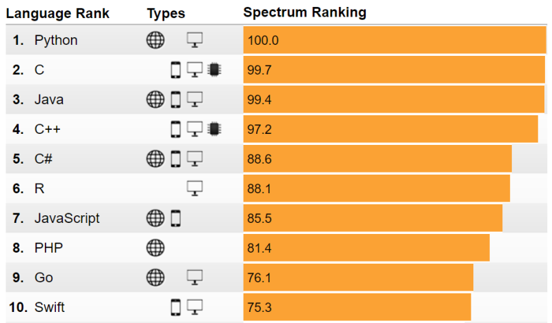
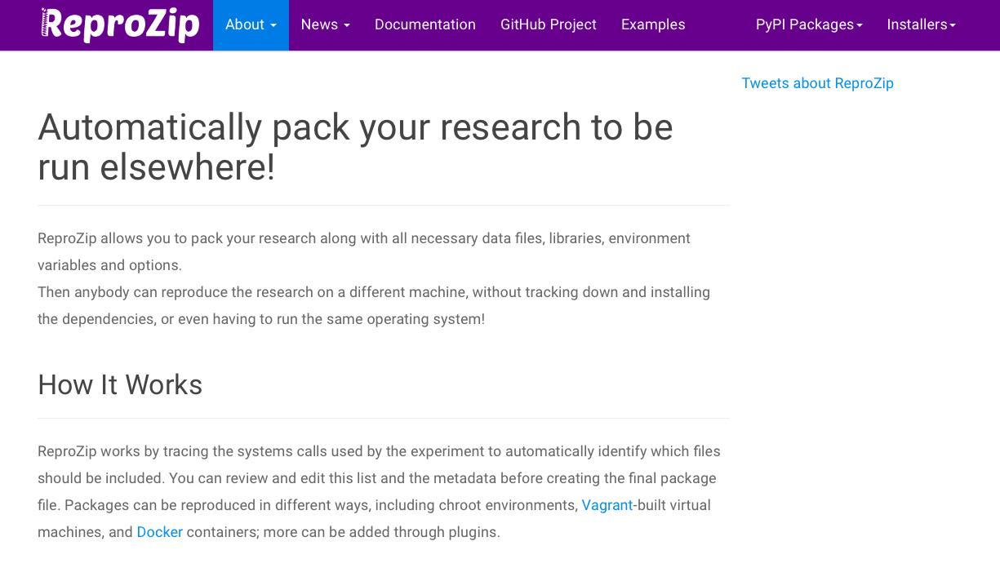
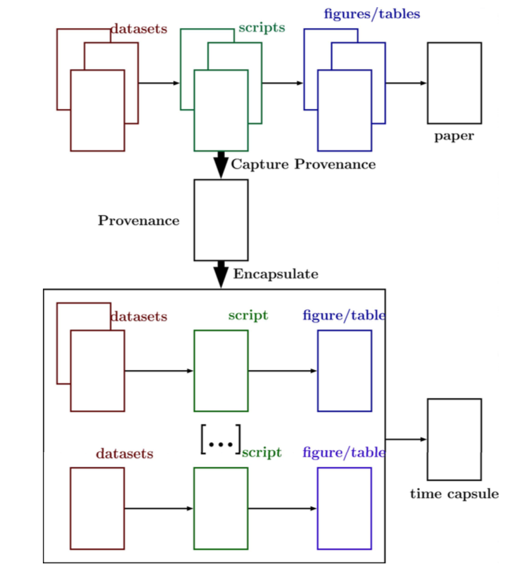

<!-- output: powerpoint_presentation -->
<!-- ```{r setup, include=FALSE} -->
<!-- knitr::opts_chunk$set(echo = FALSE) -->
<!-- ``` -->

# 

<!-- # The Reproducibility Crisis -->

\note{
- Crisis: rampant irreproducibility
- Opportunity: better science
- Continuous Integration and Capsules
- Provenance and bridging the Software Engineering Gap
}

\ 

# 

\ 

# 

\ 


# 

\ 

# 

The Chinese use two brush strokes to write the word "crisis." One
brush stroke stands for danger; the other for opportunity. In a
crisis, be aware of the danger -- but recognize the opportunity.

John F. Kennedy

*Speech in Indianapolis* (April 12, 1959)


# 

\note{A significant portion is computational methodological}

\ 


# Opportunity: Benefaction not just reproducibility

\note{Defining benefaction and opportunity}

{width=70%}\ 

*Colberg et al. 2015 Comm ACM*

# Opportunity: Benefaction not just reproducibility

{width=70%}\ 

*Colberg et al. 2015 Comm ACM*

# Opportunity: Benefaction not just reproducibility

{width=70%}\ 

*Colberg et al. 2015 Comm ACM*

# Benefaction: Computational Best Practices

- Open data (FAIR, Dataverse, Data Dryad)
- Open software (R, python, Julia)
- Project architecture (README, src, doc, data, bin, results)
- Notebooks (Rmarkdown, Jupyter)
- Version control (git, subversion)

# Benefaction: Capsules & Continuous Integration

\ 

# Benefaction: Capsules & Continuous Integration

\\ 

# Scientific culture is shifiting

{width=90%}\ 


# Scientific culture is shifiting

{width=50%}\ 

*Meeslan, Heer and White 2016 Trends in Eco Evo*

# Scientific culture is shifiting

{width=80%}\ 

*Crosas et al. 2018 SocArXiv*

# Journal Policy Impacts

{width=80%}\ 

<!-- # Journal Policy Impacts -->
<!-- {width=70%}\  -->
<!-- *Stodden et al. 2018 PNAS* -->
<!-- # Journal Policy Impacts -->
<!-- {width=50%}\  -->
<!-- *Stodden et al. 2018 PNAS* -->

# 

\note{
- Top-down approach likely not successful
- Tools need to be easier to facilitate better computer sci
}

\ 


# 

<!-- I'm an ecologist -->

\ 

# 

\ 


# Reality = An Engineering Gap

\ 

\note{
- Broad programming is relatively recent
- R has enabled rapid growth 
- R is for Rube-Goldberg-Machines
- The Wild Wild West
}

# Reality = The Engineering Gap

{width=70%}\ 

<!-- However, after almost ten years of being an open-source advocate... -->
<!-- Ecologists aren't CS majors, they're tree climbing, scub-diving types -->


# Reality = The Engineering Gap


# Reality = The Engineering Gap

{width=70%}\

<!-- ```{r echo = FALSE, out.width = "70%", dpi = 10} -->
<!-- knitr::include_graphics("./nsd.png") -->
<!-- ``` -->


# Reality = The Engineering Gap

{width=70%}\ 

<!-- Similar challenges in Ecosystem Ecology and Particle Physics -->

# 

*Most scientists don't want to produce software, they want to do their
 science.*


# encapsulator


# encapsulator

\note{
- similar to reprozip
- could work with any language that has provenance
- features code cleaning using Rclean
}

\ 


# encapsulator

Goal: Simplify computational reproducibility

1. Create a data "capsule" with code, data and environment


# encapsulator

Goal: Simplify computational reproducibility

1. Create a data "capsule" with code, data and environment
2. Increase transparency with "cleaned" code and workspace


# encapsulator

Goal: Simplify computational reproducibility

1. Capsule = all necessary software and data
2. Cleaned = organize files, remove non-essential code and re-format


# encapsulator

{width=80%}\ 

# What is data provenance?

{width=80%}\ 


# encapsulator

Example: Messycode.R

{width=70%}\ 

# encapsulator

Example: Messycode.R

- near stream-of-consciousness coding that follows a train of thought in script development,
- output to console that is not written to disk,
- intermediate objects that are abandoned,
- library and new data calls throughout the script,
- output written to disk but not used in final documents,
- code that is not modularized,
- code that is syntactically correct but not particularly comprehensible.

# encapsulator

Example: Messycode.R

{width=70%}

# encapsulator

Example: Messycode.R

{width=70%}


# encapsulator

Basic Usage (current paradigm):

1. Code as usual in your normal environment while recording provenance
2. Run encapsulator from the console
3. List desired results
4. Product = Capsule containing essential code and data with a virtual machine


# Conclusion

- Capsules = sharing (data, code, metadata)
- Continuous Integration = development * sharing * discovery
- Support the transition to using CI and capsules

# Thanks you

*Contact Info:*

**Email: _matthewklau@fas.harvard.edu_**

**Github: MKLau**

**Slack: MKLau**

*Much of this work was supported by NSF SSI-1450277 (End-to-End Provenance) and ACI-1448123 (Citation++).*
*More details are available at https://projects.iq.harvard.edu/provenance-at-harvard*

{width=19%}\ 
{width=20%}\ 
{width=25%}\ 
{width=15%}\ 


<!-- # Tools: Overview -->

<!-- |                 | Dataverse  | Code Ocean  |  Zenodo   | Figshare  | Dryad    | PANGAEA | GitHub & Bitbucket | Supplementary Material | -->
<!-- | :-------------- | :----:     | :----:      | :----:    | :-------: | :---:    | :-----: | :----------------: | :--------------------: | -->
<!-- | Meta Data       | Yes        | Yes         |  Yes      | Yes       | Yes      | Yes     | Yes                | Yes                    | -->
<!-- | Data Hosting    | Yes        | Yes         |  Yes      | Yes       | Yes      | Yes     | Yes                | Yes                    | -->
<!-- | Code Hosting    | Yes        | Yes         |  Yes      | No        | No       | No      | Yes                | Yes                    | -->
<!-- | Versioning      | No?        | No?         |  Yes      | No        | No       | No      | Yes                | No                     | -->
<!-- | Capsules        | No         | Yes         |  No       | No        | No       | No      | No                 | No                     | -->
<!-- | Assigns DOI     | Yes        | Yes         |  Yes      | Yes       | Yes      | Yes     | No                 | No                     | -->
<!-- | License         | Flexible   | Flexible    | Flexible  | MIT       | CC0      | CC-BY   | Flexible           | None                   | -->
<!-- | Cost            | None       | Possible    |  None     | None      | Possible | None    | None               | None                   | -->

<!-- *Adapted from Mislan, Heer & White 2016 Trends in Ecol Evol* -->


<!-- # encapsulator(A Kit of Parts): Checking inputs and outputs -->

<!-- - *lintR* (Hester 2017) -->
<!-- - *containR* (Chen 2018) -->

<!-- # encapsulator(A Kit of Parts): Code Formatting -->

<!-- - *formatR* (Xie 2017)  -->
<!-- - *styler* (Muller & Walther 2018) -->

<!-- # encapsulator(A Kit of Parts): Code Cleaning  -->

<!-- - *Rclean* (Lau 2018)  -->
<!-- - *CodeDepends* (Lang et al. 2018) -->
