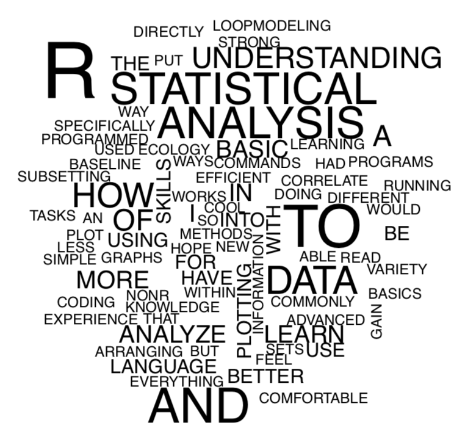
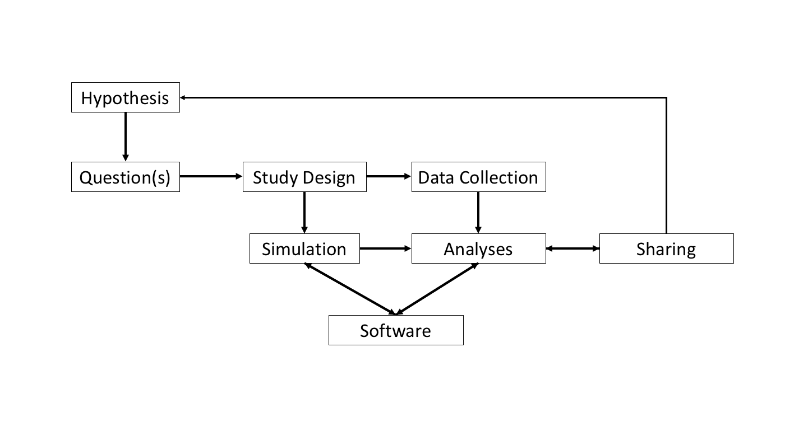
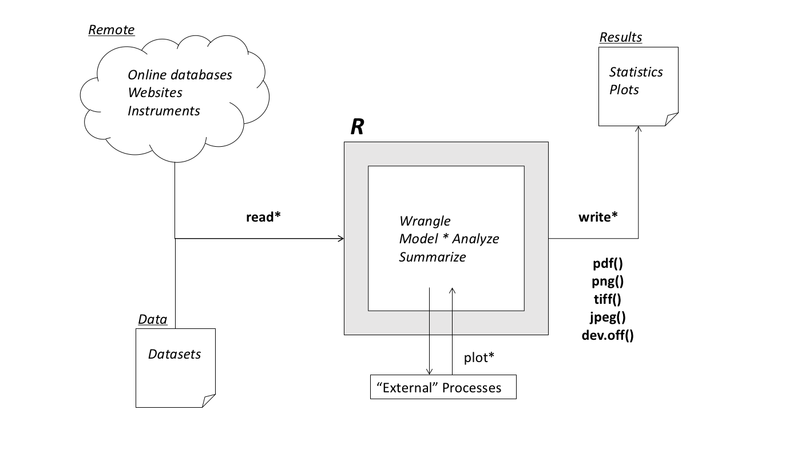

```{r, echo = FALSE, results = "hide", eval = FALSE}
## https://rmarkdown.rstudio.com/lesson-9.html
library(tufte)
rmarkdown::render("notes.Rmd", output_format = "html_document",output_file = "../docs/notes.html"); 
rmarkdown::render("notes.Rmd", output_format = "pdf_document", output_file = "../docs/notes.pdf")
rmarkdown::render("notes.Rmd", output_format = "tufte_handout", output_file = "../docs/notes_tufte.pdf")
rmarkdown::render("notes.Rmd", output_format = "tufte_html", output_file = "../docs/notes_tufte.html")
rmarkdown::render("notes.Rmd", output_format = "slidy_presentation", output_file = "../docs/notes_slidy.html")
rmarkdown::render("notes.Rmd", output_format = "beamer_presentation", output_file = "../docs/notes_beamer.pdf")

```

# Why make your work reproducible and how can coding help?

Science is driven by the exchange of information and
knowledge. Currently, there is a lot that we can do to make research
more transparent and useful. A recent study (Stodden *et al.* 2018)
demonstrated that only 26% of studies published in *Science* could be
reproduced. This was even more striking given that the study was
conducted after the *Science* had instituted it's open data policy.

What this and other studies point to is the need to provide well
documented data as well as the software that were needed to conduct
the study. Luckily, advances in open-source computer languages, such
as **R** and **python**, provide a way to produce computations that
can more easily document scientific research in a transparent, easily
shared way.

In this course, we will cover how to conduct **reproducible**
scientific research using the **R** programming language and
supporting software that will enable researchers to more clearly and
easily document projects. Participants will gain experience coding in
**R** using the *RStudio* IDE and the *git* version control system.

- Day 1: Motiviation and framework for scientific reproducibility and
  the basics of using **R** in *RStudio*
- Day 2: Scientific scripts and best practics for code and projects
- Day 3: Tools for keeping track of versions and code dependencies

- **Total Class Time: 4.5 hours**
- **Goals: Use R and other tools to conduct reproducible research.**



This is a diagram exploring the comments made by workshop participants
regarding what they hope to gain from the course. A few things that
stood out in looking this over:

- People wanted to learn **R** (Kaboom, my mind explodes!)
- A lot of interest in statistical analysis. Although we won't have
time to actually cover staistical analyses, this class will enable
folks to learn and implement new stats methods on their own.
- Everyone had something that they wanted to learn how to do. Although
there will be a wide range of abilities in this class, everyone can
look at this as an opportunity to learn something.


## Being a good code community member (5 min)

We're about to start an activity, and it should be collaborative. If
you don't understand something, try to figure it out and then ask the
internet or someone else participating in the workshop (like me!). To
make sure that we foster an open, productive and safe community
everyone participating in this course will follow the Code of Conduct
outline by the folks at ROpenSci (https://ropensci.org/coc/).

Similar to science in general software development is empowered by
community. Please contribute to this by, in particular:

- *We all get out of this class what we put into it.*
- *Be considerate and respectiful of each other in speech and actions.*
- *Contribute a safe and effective learning experience for everyone.*

Also, please take a look at the Ada Initiative webpage for more
information about creating an inclusive coding community:
https://adainitiative.org/

# Day 1

## Reproducibility Framework (10 min)

**Max(reproducibility) = Data * Software * Documentation**

1. Setup your project so that there is a clear architecture (*RStudio*)
2. Work so that your computation from initial data to finished results
will be coded (wherever possible), including data cleaning and
processing steps (**R**)
3. Keep track of versions of your code (*git*)
4. Make initial data available (whenever possible, *git*)
5. Keep track of software dependencies (*packrat*, *git*)
5. Be organized, succinct in style, coding and documentation (**R**,
   *Markdown*, *formatR*)

If you're interested in more details on how to conduct reproducible
research, see the **TEE** (Transparency in Ecology and Evolution)
website http://www.ecoevotransparency.org/ and the **FAIR**
reproducible research guide at
https://www.go-fair.org/fair-principles/.


## RStudio Tour (10 min)

To use RStudio, you will need to download and install both of the following:

1. **R** https://cran.r-project.org/
2. *RStudio* https://www.rstudio.com/products/rstudio/download/#download/


I highly recommend referring to RStudio's *Cheat Sheets*, especially
for using RStudio and basics of R.

- https://www.rstudio.com/resources/cheatsheets/

## R and RStudio

**R** is a statistical programming language. It is just text that
follows specific rules that a computer can interpret as "things" that
it is supposed to do.

*RStudio* provides an interface to R and other tools. 

Here are some of the parts of *RStudio*:

## Console

The Console is a window that can be used to "speak" R directly to the
computer. It has a little ">" symbol that indicates where you can
enter code (where the cursor is) and the code that you have already
run (above where the cursor is). This is a handy place to conduct
tasks that you don't want to keep for later usage.

## Activity: Operations (5 min)

Here's a bit of R.

In the command-line write some code that creates two objects "a"
equal to 2, "b" also equal to "2" and then create a third object "c"
that is equal to the product of "a" and "b". Then, find the
square-root of "c".

## Operations

**R** has many mathematical operations, including

```{r, echo = TRUE, eval = FALSE}

2 + 2   # addition
2 - 2   # substraction
2 * 2   # multiplication
2 / 2   # division
2^2     # powers
2 %*% 2 # matrix multiplication
print("And more!")

```

## Script(s)

Scripts are text files whose syntax follows the specifications of a
programming language. Usually scripts are code that is aimed at doing
a bunch of tasks, like analyze some data and produce output. 

## The "Workbench"

A set of windows (usually to the right of the Console and Scripts)
with useful tools from *RStudio*. There are many possible tabs that
could occur here. These are some of the possbiliites:

- **Environment** shows you what "data" you currently have loaded into
**R**'s memory
- **History** shows you what you've done with **R**
- **Files** is a tab that will show you the files in your system
- **Plot** shows plots that you have generated
- **Help** will allow you to search for topics specific to the **R**
language
- **Packages** we'll get to this later, but this is a way to add-on to
the functionality of **R**
- **Viewer** similar to the *Plot* tab, this will show you a data
  table 


## Activity: Example Project (15 min)

Download, unzip and open up the example project in RStudio, check your
working directory and run the *basics.R* script.

https://github.com/HarvardForest/repro_example

1. Click the "Clone or download" button and choose "Download ZIP"
2. Un-zip the repository using your system's unzip tool (often this
can be accessed by right-clicking on the Zip)
3. Open R-Studio
4. From the "File" menu, choose "Open Project" and navigate to the
unzipped project and click "Open"
5. Run the script 
6. Make sure that the working directory is set to the project
directory (search the *RStudio* help system for "Set Working Directory")

## What is the Working Directory?

The *working directory* is a specific directory location in your file
system that you can set in **R**'s memory. Having this makes life a
lot easier in many ways, but the main one is that it allows **R** to
make assumptions about the files that you're referring to in your
code.

# Break for ten minutes 

<!-- 60 min -->


## Anatomy of an R Script (10 min)

Let's look a little more closely at basics.R

```{r, eval = FALSE}
# Basic R script

# MK Lau

# 15 April 2018

dat <- read.csv(file = "./data/data.csv")

cor.test(dat[,"x"], dat[,"y"])

plot(y ~ x, data = dat)
```


What do you notice about it?

Here are some general things that this script represents for scripts
in **R** generally:

1. It is ordered such that the code at the top should be run before
the code lower in the script
2. Code that is to the right of hashes ("#") is not executed
3. There are commands (aka. functions) that are followed by an open
parenthesis, then some more words and then a close parenthesis
4. Typically data analysis workflow consists of read-in, wrangle and
then analyze data
5. **R** is similar to English, so if you want to do something (like
plot some data) it is often similar to what you think it might be

## Function Anatomy

1. Function have names, like "plot", "mean", "help", etc.
2. Information (aka. "arguments") are given to objects inside of
parentheses
3. Arguments are defined using equal signs ("=") and separated by
   commas (",")

Note that arguments **usually** exist only inside of functions, so you
can't access the information inside of functions unless it's
specifically passed out of that function.

Also, functions can have many arguments. Functions have to define
default settings and orderings for arguments. Because of this, you
don't always have to tell a function the value of every argument and
you don't always have to define an argument by name with an equal
sign. 

## Objects and Assignments

**Objects** are a used to tell **R** that some data should be kept in its
working memory that can be called by that objects name, as in "dat" in
the above example.

**Assignments** are used to create objects with data. This is done in
  the above example with the "<-" (aka. left arrow). There are lots of
  other ways to conduct assignments, including "=", but the left arrow
  is generally the best to use for code clarity. 

## Getting help with R

Now that you have a basic understanding of functions and arguments,
you can expand on your **R** vocab by trial and error and getting
help. Here are some useful ways to get help:

- *?*, *??*, *help*
- Google ("How do I _____ in R?")
- Community (This is not a a test, this is life)

## Review and Q/A (10 min)

1. Importance of reproducibility
2. Max(reproduciblity) = data * software * docs
3. RStudio
4. R language (Arguments, Functions, Scripts)
5. Getting help


## Code to generate the wordcloud


```{r, eval = FALSE}
### Analysis of pre-workshop data for Students

library(readxl)
library(wordcloud)

### Load data
sheets <- readxl::excel_sheets(path="../data/local_data/R Workshop Pre&Post Surveys.xlsx")
pre.data <- lapply(1:length(sheets), 
                   readxl::read_xlsx, 
                   path = "../data/local_data/R Workshop Pre&Post Surveys.xlsx")
names(pre.data) <- sheets

### Data wrangling
quest <- as.data.frame(pre.data[[1]])[-1,]
quest <- quest[grepl("pre", quest[,2]),]
resp <- as.data.frame(pre.data[[2]])[-1,]

### Text processing to generate wordcloud
comments <- as.character(na.omit((resp[,"4"])))
wc <- paste(comments, collapse = " ")
wc <- tolower(wc)
wc <- strsplit(wc, "")[[1]]
wc <- wc[wc %in% c(letters, " ")]
wc <- toupper(paste(wc, collapse = ""))
wc <- strsplit(wc, split = " ")[[1]]
wc <- table(wc)

### Plotting
pdf("../docs/cloud_2018.pdf", height = 10, width = 10)
wordcloud(names(wc), wc, min.freq = 1)
dev.off()

```


# Day 2

<!--           -->
<!-- **Day 2** -->
<!--           -->

## Stickys and Cheat sheets!

*Please write what you would like me to call you on the front of your sticky*

https://www.rstudio.com/resources/cheatsheets/

- *RStudio IDE Cheat Sheet*
- *Base R*

## Reproducibility Mantra (5 min)



**Max(reproducibility) = Documentation * Data * Software**

## Project Architecture (10 min)



In this section, we'll go over some project best practices that
generally work for computational projects. We'll initiate a new
project from *RStudio* and set up a file system with:

- **README**: describes the project and associated files
- **data**: folder to collect relevant data files or links
- **src**: where all of the **R** scripts should be kept
- **results**: this is where output from scripts can go
- **docs**: further documentation and relevant files (e.g. notes, papers)
- **bin**: ADVANCED - if you need to include other associated
  software, such as compiled (binary) code

This file structure gives a consistent file framework for organizing
almost any project. One major benefit of this is that we 


## More on Plotting (5 min)

1. Plots are built in layers
2. There is no *write* for plots, use *pdf*, *jpeg*, *png*, *tiff*,
etc. and *dev.off* (see below)
3. You can use formulae and the "data" argument in *plot* but not some
functions, like *text*

```{r, eval = FALSE}

xy.dat <- read.csv("./data/data.csv")

pdf(file = "./results/xy_plot.pdf")

plot(y ~ x, data = xy.dat, 
     xlab = "X Axis", ylab = "Y Axis")
abline(lm(y ~ x, data = xy.dat))
text(xy.dat[, "x"], xy.dat[, "y"], 
     labels = xy.dat[, "x"])

dev.off()

```

## Activity: Write your own plot code (10 min)

1. Open up a new script window
2. Write a header
3. Save your initial script
4. Import the data.csv
5. Make a different plot

## Clean Code (5 min)

Just because the computer can understand your code, doesn't mean a
human can.

*Have some style*

Style guide = http://r-pkgs.had.co.nz/style.html

- Comment clearly before sections (##) and judiciously after functions (#)
- Use good syntax with the "reformat" function or run *formatR* on your code
- Program "literately" with *Rmarkdown* or *Jupyter* notebooks

*How best to name objects*

- Keep it simple (3-10 characters)
- Use a "." or "_" to separate
- Don't start with numbers or operations
- Case matters (UPPER and lower)
- Rely on your comments for clarity

```{r, eval = FALSE}

## Here's a good name

spp.loc <- read.csv("./data/species_coordinates.csv") 

## Here're some not so good names

thisisreallyreallylong <- read.csv("./data/species_coordinates.csv") 

h_a_r_d_t_o_t_y_p_e <- read.csv("./data/species_coordinates.csv") 

.naming <- read.csv("./data/species_coordinates.csv") 

```

## ACTIVITY: Reformat your code (3 min)

1. Highlight all of your code that you want to reformat
2. Use the "reformat code" command in RStudio (see the RStudio help)


## Data wrangling (10 min)

A general data structure is two dimensional with individual
observations in rows and attributes of each observation in columns.

I highly recommend that if you use this structure, and not a database,
to save your data as a Comma Separated Value (CSV) format. This is a
simple, non-proprietary format that you can choose as an exported or
"save-as" option in most spreadsheet programs.

Because we can do calcualtions and statistics in **R**, there isn't a
need for the book keeping features that spreadsheet programs, such as
Excel and Open-Office, were written to do. We can therefore just use
the spreadsheets to create our CSV files and do the rest in **R**. 

The following are some basic concepts to know that are useful for data
wrangling in **R**.

*Working Director*

- *getwd* tells you the path for your current working directory
- *setwd* sets your working directory to the path that you give it
- *dir* lists the files in your working directory or specified path

*Relative Paths*

- "./" current directory
- "../" previous directory
- "../../../../../../../../../" probably not acutally a directory
- "~/" the "home" directory
- "/" the "root" directory

*File I/O*

- *read.* reads in a file to an object
- *write.* writes out an object to a file

*Objects and Assignments*

- "<-" creates an object on the left from some input on the right
- "->" creates an object on the right from some input on the left
- "=" creates an object in whatever direction makes sense (AVOID USING THIS)
- *assign* creates an object given a name and input (ADVANCED)
- "-->" and "<--" used to create objects in different environments (SUPER ADVANCED)
- *ls* tells you the objects that **R** has in memory
- *rm* will remove the objets that in memory


```{r, eval = FALSE}

## Quick way to clear your global environment

rm(list = ls())

```

*Data Mode*: Modes are the kind of data. This determines what can be done with
the data themselves. 

- numeric data are numbers
- character data are characters
- logical data are TRUE or FALSE
- factor data have complex definitions with properties such as order
- *mode*
- *is.* checks if an object is a specific mode
- *as.* coerces an object to a specific mode
- *length* the number of values in a vector
- *dim* dimensionality of an n-dimenisional object
- *summary* summarizes aspects of an object

*Data Class*: Classes are specific ways that the data are
organized. This determines how the information can be indexed.

- "Scalars" are single values. This isn't an acutal class in **R**.
- Vectors have one dimension, i.e. they're a collection of scalars.
- Matrices have two dimensions, i.e. they're a collection of vectors.
- Arrays have n-dimensions, but everything is the same mode.
- Lists can be "ragged" and comprised of different modes. 
- Data Frames (often the DEFAULT) are lists that function like
  matrices but the columns can be different modes. 
- *class* tells you the class of an object

## Indexing, Sorting and Matching

- *[]* the brackets are **R**'s way to refer to parts of data
  objects. 
- *sort* will produce a re-ordered vector based on numeric or
  alphabetical sorting rules. 
- *order* will produce a vector of the ordering of a vector.
- *match* produces the indices for matches between two vectors.
- *%in%* will tell you which values of a given vector are in another. 

**WARNING!** Many sorting and matching functions will work on other
data types; however, make sure that you pay attention to what they are
actually doing!

## Activity: Explore data modes, object class and indexing

```{r, eval = TRUE}

## This is a scalar, though R will treat it as a vector

1 
x <- 1
is.vector(x)

## A quick way to create an integer vector

vec <- 1:10
vec[1]

## Another way to create the same vector via concatenation

vec <- c(1, 2, 3, 4, 5, 6, 7, 8, 9, 10)
vec[1]

## Indexing everything in the vector EXCEPT the first value
vec[-1]

## Indexing the first 2 values three different ways

vec[1]
vec[2]
vec[c(1, 2)]
vec[1:2]

## Creating a matrix and indexing the first row, first column

mat <- matrix(1:27, nrow = 9, ncol = 3)


## We index matrices similarly to vectors, but now we 
## have two dimensions

mat[1,1]

## R assumes that you want all the data in an object
## unless you tell it otherwise

mat

## So, we can access everything in the first row 

mat[1, ]

## Or, everything in the first column

mat[, 1]

## Or, multiple columns

mat[, 1:3]


```

## Activity: lists and data frames (10 min)


```{r }
## Creating a data frame and indexing the first column

df <- data.frame(x = 3:10, y = letters[3:10])

# These are all different ways to index the first column ("x")

df[, 1] # By the number of the column
df[, "x"] # By name of a column
df[, x] # Also, by name of a column, without quoting
df[[x]]

# These are all different ways to index the first row

df[1, ] # By the number of the row

# Indexing rows by names can also be done, as long as the rows have names assigned to them

rownames(df)
df["1", ]

```

## Changing values in objects (1 min)

This is s

```{r , eval = FALSE}

df[1, 1] <- 10
df[, 1:3] <- 10:12
df[, "x"] <- new.x

```

## Activity: Wrangle those data! (10 min)

1. Start a new script called "iris.R"
2. Load the dataset "iris" using *data(iris)*
3. Then do the following wranglings:

```{r, eval = FALSE}

data(iris)

# Take a second to explore the data set

# The first "Sepal Length" value is wrong. Fix it so that it is 51.5.

# Turns out, the actual sepal widths are off by a factor of two
# Fix it so that the widths are twice the initial values


# Somone forget to enter the stem data. 
# Luckily we know that the stems scale allometrically as
# Twice the sepal length plus the square of the petal length
# Calculate the stem length and add a new column called "Stem.Length"

```

## 
## 
## 
## Wait for it...
## 
## 
## 

```{r, eval = FALSE}

data(iris)

# Take a second to explore the data set
str(iris)
summary(iris)
colnames(iris)

# The first "Sepal.Length" value is wrong. Fix it so that it is 51.5.
iris[1, "Sepal.Length"] <- 51.5

# Turns out, the actual sepal widths are off by a factor of two
# Fix it so that the widths are twice the initial values
iris[, "Sepal.Width"] <- iris[, "Sepal.Width"] * 2

# Somone forget to enter the stem data. 
# Luckily we know that the stems scale allometrically as
# Twice the sepal length plus the square of the petal length
# Calculate the stem length and add a new column called "Stem.Length"
Stem.Length <- iris[, "Sepal.Length"] * 2 + iris[, "Petal.Length"]^2
iris <- data.frame(iris, Stem.Length)

```

## Review and Q/A (5 min)

1. Project organization
2. Data wrangling


# Day 3

<!--           -->
<!-- **Day 3** -->
<!--           -->

## Reproducibility Mantra 

**Max(reproducibility) = Documentation * Data * Software**

## "Backing Up" Version Control (5 min)

In this section, you'll learn how to use the version control system,
known as git, from RStudio. We will cover the basic topics of how to:

1. Initiate a project "repository"
2. Create, "add" and "commit" changes
3. View "diffs" and share a compressed project

We will not cover how to use the online git repository known as
*github*. Using *github* provides a central server through which
projects can be shared among collaborators in real-time via a system
that keeps users from stepping on each other's "digital toes". To
setup a free, private repository through *github.com*, go to their
educational program webpage: https://education.github.com


## Activity: Working with real data (15 min)

**Citizen Science - Firefly Watch**

Dr. Sara Lewis at Tufts University

https://www.massaudubon.org/get-involved/citizen-science/firefly-watch

*Setup a new project*

1. Create a new project (*File -> New Project -> New Directory ->
   firefly*, check "Create a git repository") 
2. Setup the standard project directories (*data, doc, results, src*, *bin*)
3. Download the firefly data from https://github.com/MKLau/reprosci/blob/master/data/FFW_Data_2016.csv
4. Create a new script in *src* called "firefly.R"
5. Now start writing your script with your header
6. Import the data
7. Explore them using *head*, *tail*
8. *str* and *summary*

**Make sure that your working directory is set correctly**

## Get versioning with git (10 min)

Git just tracks changes made to files. This is an extremely efficient
way to keep a record of what has been done to a project. It was
designed for writing software, but it will work with many file
types. It works best with text files. 

Here are the basic terms to know:

- *repository* = a directory that has some hidden files that git
  recognizes. Only files within the repository are tracked
- *add* = telling git what files you would like to track (aka. stage)
- *commit* = logs the changes to the tracked files

## Commit best practices 

1. Commits should represent a task that has progressed or completed
2. Files with changes relevant to those tasks should be staged
3. In general commit often and describe commits succinctly but
informatively

Examples:

- Not so good = "Some changes"
- Pretty darn good = "Added import plant data"

## Activity: Commit your changes (5 min)

1. Go to the git tab
2. Select the files that you wish to add to the stage
3. Click commit

# Break for ten minutes 

## Data wrangling review from Day 2 (10 min)

We're going to cover some more info on how to work with data.

<!-- 60 min -->


## Activity: Play with the firefly data (10 min)

- Try subsetting and sorting the data
- Recombine the data into new variables
- Make some plots to explore the data

## Feeling like you're struggling with wrangling? Try this activity.
## Activity: Make two vectors (each of length 5) and combine into a data frame (10 min)

Play with your data. Try indexing, sorting and moving the data around
into different objects.


## Wrap-up on Reproducibility with **R** (5 min)

1. Max(reproducible) = data * software * docs
2. Project architecture for better access
3. Document (comment, follow style, "Brevity is the soul of wit.")
4. Planned obsolescence: Backup and version
5. Share your results, code and data

## Post-workshop Sessions

1. *packrat*, *Rmarkdown*, github and data testing
2. Possible: Advanced Topics Discussions (see *Advanced Topics*)

- 1-hour sessions for 5 or more REUs
- Zoom
- Museum or remote locations


# Day (n + 3)


## Software Dependencies: R Packages and CRAN *et al.* 

Functions and other information are grouped into packages and hosted
on CRAN (Comprehensive **R** Archive Network). This modular structure
allows **R** to grow but still be usable. As of 2016 there were over
8,000 packages on CRAN, an increase of 2,000 from 2015. 

https://www.r-bloggers.com/on-the-growth-of-cran-packages/

With regard to reproducibility, this creates an issue as CRAN and
**R** are constantly changing. That is why it is imperative to keep
track of the "dependencies" of your code. Ways to deal with
dependencies:

1. Minimize them
2. Track them (*sessionInfo*, *packrat*, containers/*rocker*,
   VM/*encapsulator*)

https://rviews.rstudio.com/2018/01/18/package-management-for-reproducible-r-code/

One easy way would be to just record the system and library
information using *sessionInfo*:

```{r}
print(sessionInfo(), locale = FALSE)
```

A good place for this information is in your README.

## *packrat* 

Although there are other more sophisticated ways to implement
dependency reproducibility, we'll go over *packrat*, which is
implemented in *RStudio*:

1. Tools -> Project Options
2. Packrat -> Use packrat for this project
3. Use default settings and continue

More info on *packrat* can be found here:
https://rstudio.github.io/packrat/rstudio.html

One handy thing that *packrat* enables is that it can detect what
packages your project isn't using and remove them. Use the following
bit of code to do this:

```{r, eval = FALSE}
packrat::clean()
```

**ProTip**: this syntax uses "::" (i.e. a double colon) allowing you
to specify the package ("packrat") that contains the function
("clean") that you want to use. This is extremely useful as it means
that you don't always have to load (i.e. *library*) the entire package
when you just want to use one or a few functions.

## R Markdown Notebooks

Markdown is a language use for "typesetting", like the HTML that makes
up webpages. There is also a specific syntax that can be used to
combin Markdown with the R language. This allows the creation of
documents that combine text, code and output. This is an extremely
useful tool for the scientific reproduciblity kit. One particular
aspect that is extremely powerful is the ability to automatically
create many different "rendered" documents from a single document,
such as webpages, PDFs, Shiny Apps and many more formats.

For more information, the following is a useful introduction to R
Markdown notebooks.

https://rmarkdown.rstudio.com/r_notebooks.html


## Data testing and conditionals (5 min)

Conditional statements and operations allow us to check if an
expectation is true or not. This is a crucial 

```{r, eval = FALSE}

if (is.numeric(x[,1]) == FALSE){
    warning("Danger Will Robinson!")
}else{
    print("Everything's cool...")
}

```

## Activity: Write your own test! (5 min)

Think of an assumption you would have about the data and write a test
to (at least partly) check that the firefly data are imported
correctly.


# Advanced Topics

## Data Wrangling

- *dplyr* = reorganize data
- *stringr* manipulate text (aka. "strings")
- *lubridate* for handling dates and times
- *sp* and *raster* for spatial datasets
- *purrr* "apply" functions = functions for repeating functions

## Sharing

- *github* = sharing git repositories
- *RMarkdown* = organized documentation, code and results
- *Shiny* = creating interactive representations

## Better R

- Efficiency with *profVis*
- Automated workflow tracking with data provenance *RDatatracker*
- Code cleaning with *Rclean*

## Advanced Data Science

- BASH
- Web data archives
- Open Licensing
- Continuous integration
- Virtual Machines
- Docker


